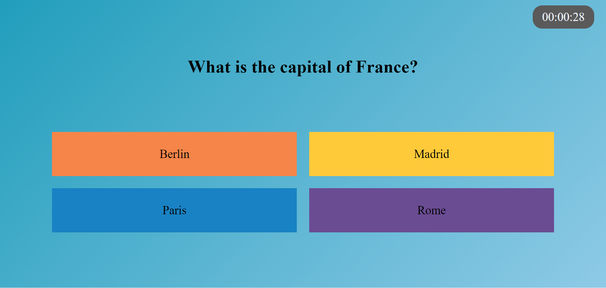
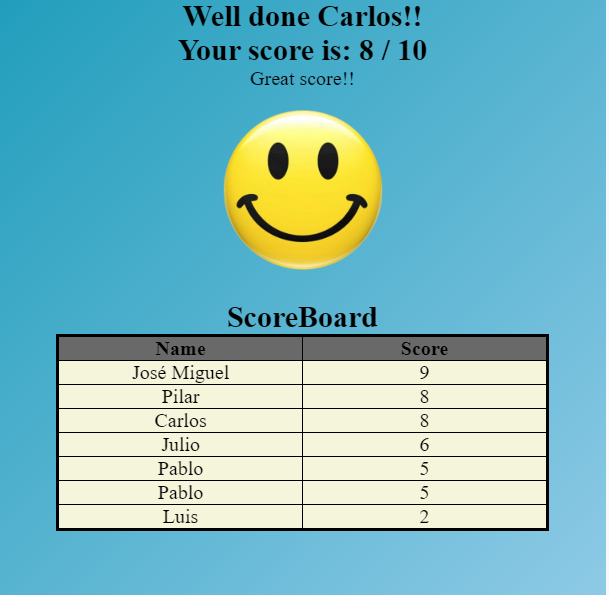

```html
<div style="width: 100vw; heigh: 20vh; background-color: #219ebc;">
  <h1 style="text-align: center">Geography Quiz</h1>
</div>
```
# Welcome to Geography Quiz! #
---
This is a simple web in which you can take a Geography test and see your score afterwards!

First you need to log with a username:
{width=50%}
Remember to type a name between 2 and 30 characters.

Second you have to answer 10 Quiz questions:
{width=50%}
Remember! There is only one correct answer!

While you take your test you will listen to some relaxing music as well as be able to see your time: 
---


Last you will be able to see your score and a table with the results of all previous players:
---
{width=50%}

## Enjoy! ##